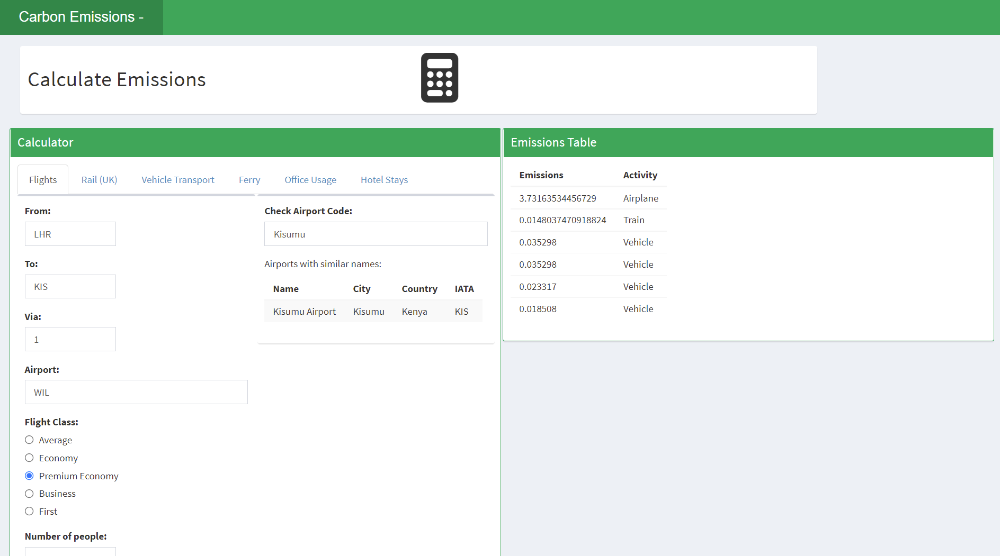

<!-- README.md is generated from README.Rmd. Please edit that file -->

# carbonr 

<!-- badges: start -->

[](https://github.com/IDEMSInternational/carbonr/actions)
[](https://app.codecov.io/gh/IDEMSInternational/carbonr?branch=main)
[](https://lifecycle.r-lib.org/articles/stages.html#experimental)
[](https://www.repostatus.org/#wip)
[](https://CRAN.R-project.org/package=carbonr)
[-lightgrey.svg)](https://www.gnu.org/licenses/lgpl-3.0.en.html)
<!-- badges: end -->

## Overview

`carbonr` is an R package designed to conveniently calculate
carbon-equivalent emissions using data from the [UK Government report
(2023)](https://www.gov.uk/government/publications/greenhouse-gas-reporting-conversion-factors-2023).

## Installation

Install the development version from GitHub with:

``` r
# install.packages("devtools")
devtools::install_github("IDEMSInternational/carbonr")
```

## Aims of carbonr

`carbonr` was developed to provide a reliable and reproducible method
for calculating carbon-equivalent emissions. It aims to:

- Ensure transparency, flexibility, and reproducibility in emissions
  calculations.
- Facilitate easy saving, editing, and redistribution of results.
- Encourage community contributions to extend functionality.
- Provide a user-friendly interface through Shiny for users with limited
  programming experience.

## Functions in `carbonr`

There are different types of functions in `carbonr`. There are travel
and accommodation based estimates based on general activities, making
them easier to use without detailed knowledge of specific inputs:

**Travel-Related Emissions**

- `airplane_emissions()`
- `ferry_emissions()`
- `rail_emissions()`
- `land_emissions()`
- `vehicle_emissions()`

**Accommodation-Related Emissions**

- `hotel_emissions()`
- `building_emissions()`
- `office_emissions()`
- `household_emissions()`

#### Raw Input-Based Emissions

These functions allow for more precise calculations by inputting
specific values, such as the quantity of materials used:

- `construction_emissions()`
- `electrical_emissions()`
- `material_emissions()`
- `metal_emissions()`
- `paper_emissions()`
- `plastic_emissions()`
- `raw_fuels()`

#### Clinical Emissions

These functions are specific to calculating emissions from clinical and
medical activities:

- `anaesthetic_emissions()`
- `clinical_emissions()`
- `clinical_theatre_data()`

All functions return carbon-equivalent emissions in tonnes. A Shiny app
is available via `shiny_emissions()` for a GUI-based calculation.

Some examples demonstrating how to use the `carbonr` package functions
can be found in the vignette.

## Additional Features

**Beyond the Emissions Available in the 2023 UK Report**

Additional functions are available for emissions not covered in the UK
Government report, such as those related to operating theatre waste.
Further details on using the operating theatre waste functions are
provided in the vignette.

The `carbon_credit_price()` function provides values based on [World
Bank data](https://carbonpricingdashboard.worldbank.org/).

**Shiny App**

An interactive calculator using Shiny can be accessed by the
`shiny_emissions()` function. This calculator uses some of the functions
in the `carbonr` package:

``` r
shiny_emissions()
```



## For the Future

As well as those outlined in the “issues”, planned features include:

- Data integration from data sets. For example, office emissions from
  accounting records.
- Comprehensive reporting tools with summary statistics, tables, and
  graphs.
- Open to further collaborations to contribute new emissions, insights,
  and methodologies.
- Continual updates to integrate the latest research.

## Contributing, Reporting Issues, and Seeking Support

We welcome contributions from the community to enhance the `carbonr`
package. If you would like to contribute, please follow these
guidelines:

- **Contribute to the software**: If you wish to contribute new
  features, fix bugs, or improve the documentation, please fork the
  repository, create a new branch for your changes, and submit a pull
  request. Ensure that your code follows the existing style and include
  tests where applicable.

- **Report issues or problems**: If you encounter any bugs or have
  suggestions for improvements, please open an issue in the [GitHub
  repository](https://github.com/IDEMSInternational/carbonr/issues).
  Provide as much detail as possible, including steps to reproduce the
  issue if applicable.

- **Seek support**: For any questions or help with using `carbonr`, you
  can reach out by opening a discussion in the [GitHub
  Discussions](https://github.com/IDEMSInternational/carbonr/discussions).

Your feedback and contributions are invaluable in helping us improve and
maintain the package.

## References

#### Other Online Calculators:

- [Carbonfund.org](https://carbonfund.org/calculation-methods/)
- [Carbon Footprint
  Calculator](https://www.carbonfootprint.com/calculatorfaqs.html)

#### Sources

1.  UK Government Report: Department for Energy Security and Net Zero.
    (2023). [Greenhouse Gas Reporting: Conversion Factors
    2023](https://www.gov.uk/government/publications/greenhouse-gas-reporting-conversion-factors-2023).

2.  Radiative Forcing Factor: DEFRA, 2016. Government GHG conversion
    factors for company reporting.

3.  Clinical Anaesthetic Emissions: Various sources including -

Varughese, S. and Ahmed, R., 2021. Environmental and occupational
considerations of anesthesia: a narrative review and update. Anesthesia
& Analgesia, 133(4), pp.826-835;

McGain, F., Muret, J., Lawson, C. and Sherman, J.D., 2020. Environmental
sustainability in anaesthesia and critical care. British Journal of
Anaesthesia, 125(5), pp.680-692;

Wyssusek, K., Chan, K.L., Eames, G. and Whately, Y., 2022. Greenhouse
gas reduction in anaesthesia practice: a departmental environmental
strategy. BMJ Open Quality, 11(3), p.e001867;

Sherman, J., Le, C., Lamers, V. and Eckelman, M., 2012. Life cycle
greenhouse gas emissions of anesthetic drugs. Anesthesia & Analgesia,
114(5), pp.1086-1090.

4.  Clinical Wet Waste Emissions: Department of Climate Change, Energy,
    the Environment and Water. (2022). [National Greenhouse Accounts
    Factors:
    2022](https://www.dcceew.gov.au/climate-change/publications/national-greenhouse-accounts-factors-2022).
